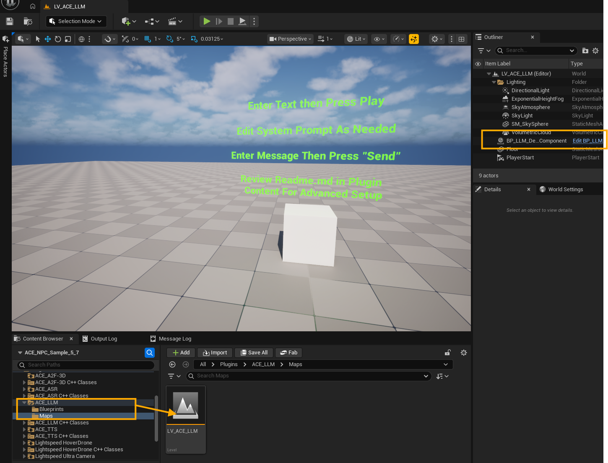
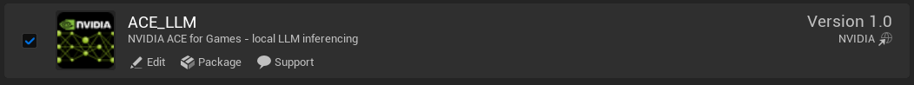
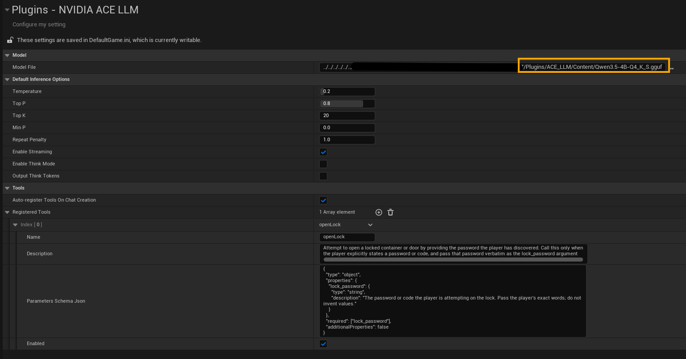
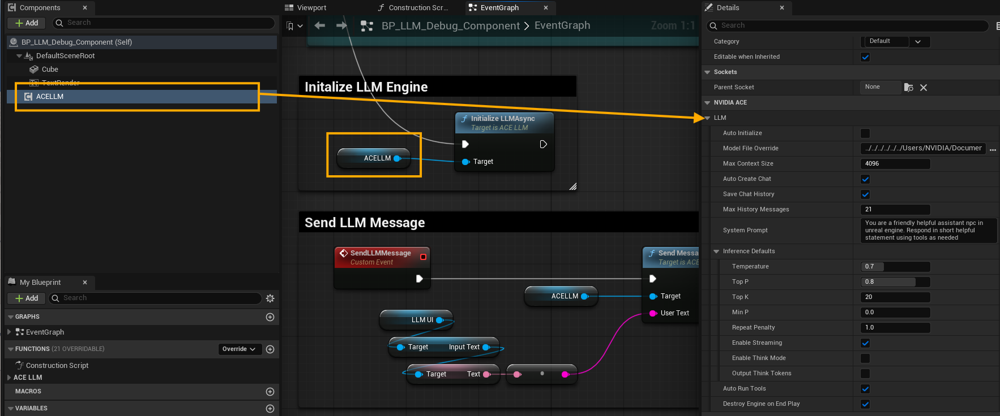
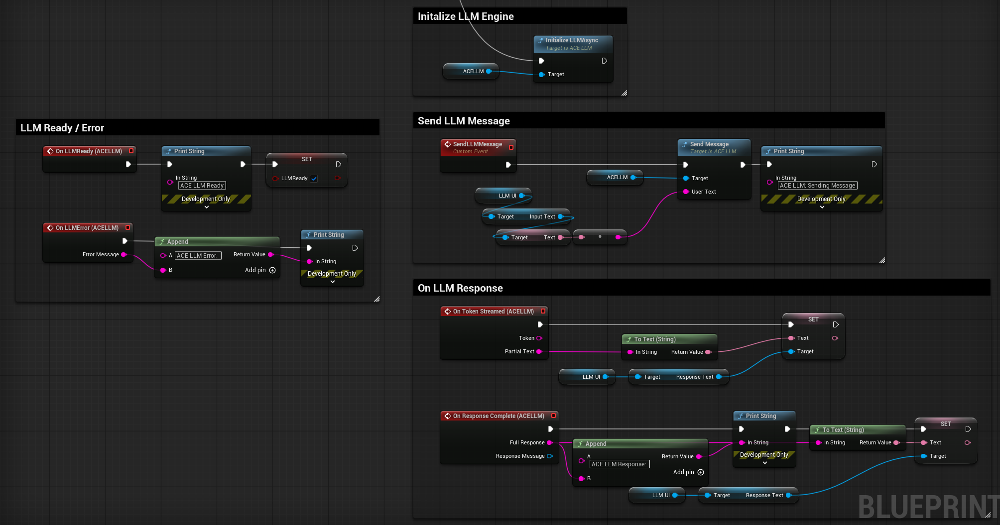
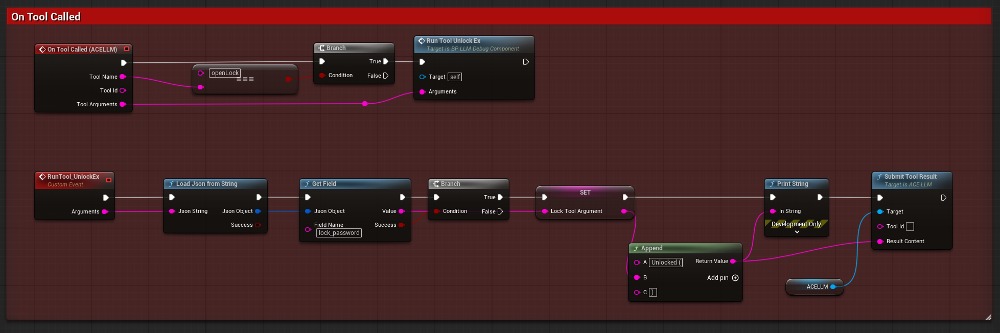
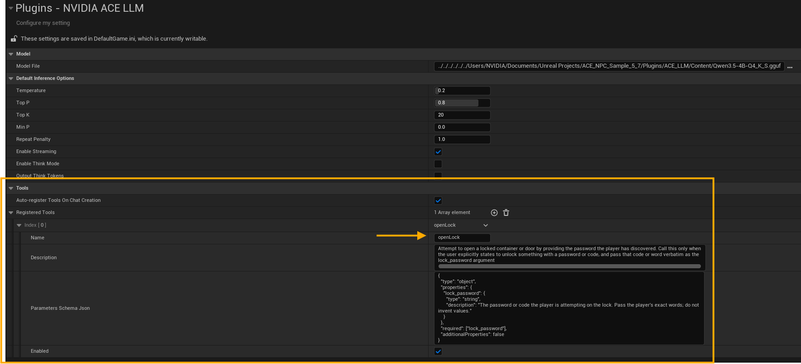
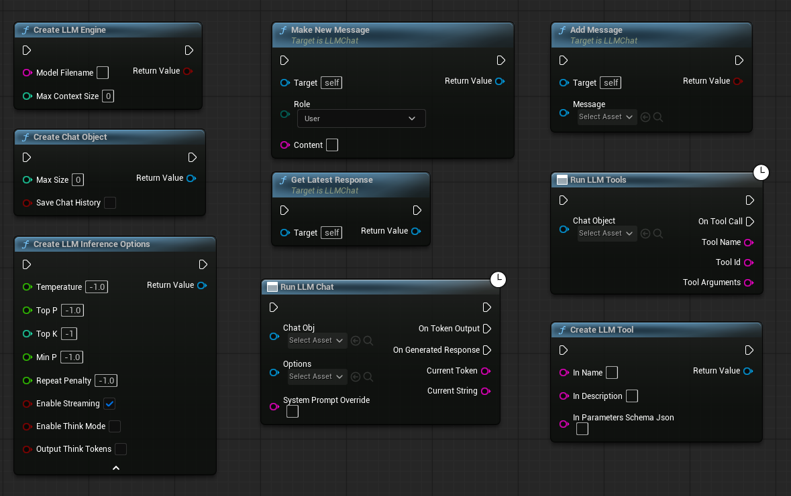

# NVIDIA ACE LLM Plugin

**Platform:** Windows 64-bit | **Engine:** Unreal Engine 5.5 - 5.7 | **Backend:** NVIDIA Game Agent SDK Chat APIs, GGUF/llama.cpp runtime

Local large language model inference for Unreal Engine using the NVIDIA Game Agent SDK Chat APIs. The plugin wraps Game Agent SDK chat, token streaming, tool calling, and low-level inference controls in Blueprint-friendly Unreal objects so projects can build conversational and agentic NPC behaviors without sending prompts to an external service.

The plugin is designed around local `.gguf` model files and the Game Agent SDK runtime included under `ThirdParty/`. It exposes chat history management, system/user/assistant/tool messages, inference options, streamed token output, and tool-call dispatch.

There are two ways to consume it:

- **`ACE LLM` component (recommended).** Drop the **`UACELLMComponent`** onto any Actor, set a system prompt, and call **Send Message** — the component owns the engine handshake, chat object, inference options, streaming, and the tool-calling loop for you. This is the fastest path for conversational and agentic NPCs and is the basis for the [Quick Start](#quick-start) below.
- **Low-level objects (advanced).** Compose `ULLMEngine` / `ULLMChat` / `ULLMInferenceOptions` / `ULLMInferenceTask` yourself for full manual control. See the [API Reference](Docs/APIGUIDE.md) and the [Manual low-level flow](#advanced--manual-low-level-flow) appendix.


---

## Pick Your Install Path First

This repository ships **plugin source code**. Choose the path that fits your project before continuing.

| Path | Best For | What You Need | Where To Go |
|---|---|---|---|
| **A. Drop-in (prebuilt)** | Blueprint projects, quick integration, Launcher builds of UE 5.5 - 5.7 | Unreal Engine + a `.gguf` model file | Continue with this README ([Quick Start](#quick-start)) |
| **B. Build from source** | C++ projects, AAA / studio workflows, custom engine builds, modifying plugin source | Visual Studio 2022 with **Desktop development with C++**, UE 5.5+ (Launcher or source build), this repo cloned into `Plugins/` | See [Docs/SOURCEUSE.md](Docs/SOURCEUSE.md) |

> **Note:** The files in this repo are organised for source builds (`Source/`, `Build.cs`, headers, `.uplugin` with `Modules`). If you only want a drop-in plugin, copy the compiled `ACE_LLM` folder directly into your project's `Plugins/` directory and open your project - Unreal will load the pre-built binaries automatically.

---

## License

Plugin source files are licensed under the MIT License as indicated by the SPDX headers in `Source/LLMPlugin`.

Models are **not bundled** and are subject to the license terms of the model provider. Review the model license before shipping it with a project. The sample `Qwen3.5-4B-Q4_K_S.gguf` placed in `Content/` is governed by the [Qwen License Agreement](https://huggingface.co/Qwen).

---

## Requirements

### Engine and OS

- **Unreal Engine** 5.5, 5.6, or 5.7 - [download from the Epic Games Launcher](https://www.unrealengine.com/en-US/download)
- **Windows 10/11 64-bit** - verify under *Settings -> System -> About -> System Type*

### GPU and Driver

- **NVIDIA GPU recommended** for GPU-backed inference. An RTX GPU (Turing or newer) is strongly recommended for the CUDA compute path.
- Install the latest **GeForce Game Ready** or **Studio** driver. Verify with `nvidia-smi` from PowerShell.
- **DirectX 12 RHI** is required when using the GPU path. Run `dxdiag` and confirm *Feature Levels* includes `12_1` or higher.
- CPU-only fallback is possible but impractical for real-time NPC use (generation speed is significantly slower).

### Memory

LLM VRAM and system RAM usage scales with model size, quantization level, and `Max Context Size`. Recommended starting budgets:

| Model size | Quantization | Approx. VRAM | Approx. RAM |
|---|---|---|---|
| 3 - 4B params | Q4_K_S / Q4_K_M | ~2 - 3 GB | ~4 GB |
| 7 - 8B params | Q4_K_M | ~4 - 5 GB | ~6 GB |
| 14B params | Q4_K_M | ~8 - 10 GB | ~12 GB |

> **Multi-plugin note:** If running alongside ACE A2F, ASR, and TTS on the same GPU, start with a 3-4B quantized model and a context size of 2048 - 4096 to leave headroom for the other systems.

### Model File

- A local `.gguf` chat model compatible with the Game Agent SDK llama backend is required. The plugin does **not** download models automatically.
- Place the model file anywhere on disk and point the plugin at it through Project Settings (see [Quick Start - Set the model path](#3-set-the-model-path)).
- The sample project includes `Qwen3.5-4B-Q4_K_S.gguf` in `Content/` as a starting point.

### Source Builds Only

- Visual Studio 2022 with the **Desktop development with C++** workload. See [Docs/SOURCEUSE.md](Docs/SOURCEUSE.md) for exact component requirements.

---

## Quick Start

> **Example Map:** Navigate to the example content map for a working example



> **First-time load:** `Create LLM Engine` loads the model synchronously and can take several seconds for multi-GB models. Call it during a loading screen or before the player reaches an NPC that needs to respond.

### 1. Drop in the plugin

1. Close the project if it is open.
2. Create a `Plugins/` directory in your project root if one does not exist.
3. Copy the `ACE_LLM` folder into `Plugins/`. The final layout must be:
   ```
   YourProject/
     YourProject.uproject
     Plugins/
       ACE_LLM/
         LLMPlugin.uplugin
         Source/
         ThirdParty/
         Content/
   ```
4. Reopen the project. Unreal will load the plugin automatically.

### 2. Enable the plugin



Open *Edit -> Plugins*, search for **ACE_LLM**, and confirm the checkbox is ticked. Restart the editor if prompted.

### 3. Set the model path

Open *Edit -> Project Settings -> Plugins -> NVIDIA ACE LLM*.



- Set **Model File** by clicking the file-browse button and selecting your `.gguf` file. Absolute paths and paths relative to the project `Content/` folder are both supported.
- Alternatively, pass a path directly to **Create LLM Engine** in Blueprint. An empty argument causes the engine to fall back to **Model File**.
- Use **Select Model To Load** in Blueprint to open a native file-picker and return a path string.

### 4. Add the ACE LLM component

Select your NPC Actor (or its Blueprint), click **Add Component**, and add **ACE LLM**. Everything below is configured in the component's **Details** panel under *NVIDIA ACE | LLM*:



| Setting | Default | Notes |
|---|---|---|
| **Auto Initialize** | `false` | When `true`, the component creates the engine during `BeginPlay`. Leave `false` to gate engine load behind a loading screen, then call **Initialize LLM Async** yourself. |
| **Model File Override** | *(empty)* | Optional per-component `.gguf` path. Empty uses **Model File** from Project Settings. The first component to initialize in the process wins (one global engine). |
| **Max Context Size** | `4096` | Token context window. Use `2048` first when sharing the GPU with other ACE plugins. |
| **Auto Create Chat** | `true` | Builds this component's chat automatically when the engine is ready, so **Send Message** works immediately. |
| **Save Chat History** | `true` | Appends each assistant reply to history for multi-turn memory. |
| **Max History Messages** | `0` | Caps the message history. `0` = unlimited. |
| **System Prompt** | *(empty)* | The NPC personality / instructions. Seeded as the system message when the chat is created. |
| **Inference Defaults** | *(see [step 6](#6-tune-generation-optional))* | Sampling / streaming options used for every **Send Message**. |
| **Auto Run Tools** | `true` | Auto-dispatches tool calls through **On Tool Called** and re-runs inference after you submit the result (see [step 7](#7-add-tool-calling-for-agentic-npcs)). |
| **Destroy Engine On End Play** | `false` | `false` keeps the engine warm across PIE for instant reuse; `true` requests teardown on `EndPlay` (a PIE-safe no-op in editor, a real free in a packaged build). |

> **One engine, many components.** The component does **not** own the model — a `UACELLMSubsystem` owns the single global engine and ref-counts interest, so you can put an `ACE LLM` component on as many NPCs as you like and they all share one loaded model. Each component keeps its **own** chat history.

### 5. Initialize and wait for ready

If **Auto Initialize** is off, call **Initialize LLM Async** (e.g. on `BeginPlay` or after a loading screen). It is idempotent and safe to call from every NPC — the shared engine loads once.

Bind **On LLM Ready** before sending anything; it fires when the engine is up (and, with **Auto Create Chat** on, the chat is built). Bind **On LLM Error** to catch a failed model load.

```text
BeginPlay  (Auto Initialize = false)
  -> ACE LLM -> Initialize LLM Async
       |-- On LLM Ready  -> enable input / hide loading UI
       +-- On LLM Error  -> show error
```

> **First-time load** still loads the model synchronously inside the engine, so trigger it during a loading screen for multi-GB models. Subsequent PIE sessions reuse the warm engine and become ready almost instantly.

### 6. Tune generation (optional)

Expand **Inference Defaults** on the component to adjust sampling and streaming. Defaults match the plugin's recommended values:

| Option | Default | Effect |
|---|---:|---|
| Temperature | `0.2` | Lower values make responses more deterministic. |
| TopP | `0.8` | Nucleus sampling threshold. |
| TopK | `20` | Hard limit on candidate tokens per step. |
| MinP | `0.0` | Minimum probability filter; `0.0` disables it. |
| RepeatPenalty | `1.0` | Increase above `1.0` to reduce repeated phrases. |
| EnableStreaming | `true` | Required for live **On Token Streamed** callbacks. |
| EnableThinkMode | `false` | Enables reasoning-token mode on supported models (e.g. Qwen-3). |
| OutputThinkTokens | `false` | When `true`, reasoning tokens appear in **On Token Streamed**. |

Change these at runtime and call **Refresh Inference Options** to apply, or use **Send Message With Options** to override sampling / system prompt for a single call.

### 6b. Send a message and receive the reply

Once **On LLM Ready** has fired, call **Send Message** with the player's text. Bind the events to receive the streamed and final reply:




- **On Response Started** — inference began (good for a "typing…" indicator).
- **On Token Streamed** — fires per token with `Token` (new) and `PartialText` (accumulated). Requires `EnableStreaming`.
- **On Response Complete** — fires once with the `FullResponse` string and the `ULLMChatMessage` wrapper.

```text
On player input received
  -> ACE LLM -> Send Message (UserText = <player text>)
       |-- On Response Started  -> show "typing…"
       |-- On Token Streamed    -> append Token to the dialogue UI
       +-- On Response Complete -> commit FullResponse
```

Multi-turn memory is automatic when **Save Chat History** is on. Call **Reset Conversation** to clear history and re-seed the system prompt between encounters.

### 7. Add tool calling for agentic NPCs

Tool calling lets the model request game actions instead of only producing text. Register tools once in *Edit → Project Settings → Plugins → NVIDIA ACE LLM → Tools → Registered Tools* (with **Auto-register Tools On Chat Creation** on, the component's chat picks them up automatically). See [step 8 below](#8-registering-tools) for the tool-definition format.

With **Auto Run Tools** on (default), the component runs the whole agentic loop for you:



1. **On Tool Called** fires once per requested tool, giving you `ToolName`, `ToolId`, and `ToolArguments` (a JSON string from the model — treat it as untrusted input and parse it).
2. Execute the matching gameplay action.
3. Call **Submit Tool Result** with your outcome. **You author** the result text — a plain sentence (`"The lock clicked open"`) or JSON (`{"success":true}`); the model reads it to compose its reply. Leave **Tool Id** empty to answer the next pending call (all a single-tool NPC needs), or pass the `ToolId` from **On Tool Called** when several tools fire in one turn.
4. The component automatically re-runs inference once every pending tool is answered, and the spoken reply arrives on **On Token Streamed** / **On Response Complete**.

```text
On player input received
  -> ACE LLM -> Send Message (UserText = "open the chest with 'swordfish'")
       +-- On Tool Called (ToolName, ToolId, ToolArguments)
             -> parse ToolArguments JSON -> run the gameplay check
             -> ACE LLM -> Submit Tool Result (ToolId = "", ResultContent = "openLock succeeded: chest is now open")
       +-- On Response Complete -> "The lock clicks open." (turn 2, automatic)
```

> **No tool fired this turn?** If **On Tool Called** never broadcasts, the user message did not warrant a tool — **On Response Complete** already carries the final spoken reply. There is no second turn to run and you do not call **Submit Tool Result**.

### 8. Registering tools

Open *Edit → Project Settings → Plugins → NVIDIA ACE LLM → Tools* and add entries to **Registered Tools**. Each entry needs a `Name`, `Description`, `Parameters Schema Json`, and `Enabled`. With **Auto-register Tools On Chat Creation** enabled (default), every chat the component creates registers these tools automatically.

Example entry for an `openLock` tool that takes a password argument:



| Field | Value |
|---|---|
| Name | `openLock` |
| Description | `Attempt to open a locked container or door by providing the password the player has discovered. Call this only when the player explicitly states a password or code, and pass that password verbatim as the lock_password argument.` |
| Enabled | `true` |

`Parameters Schema Json`:

```json
{
  "type": "object",
  "properties": {
    "lock_password": {
      "type": "string",
      "description": "The password or code the player is attempting on the lock. Pass the player's exact words; do not invent values."
    }
  },
  "required": ["lock_password"],
  "additionalProperties": false
}
```

At runtime the model emits a tool call like `{"name":"openLock","arguments":"{\"lock_password\":\"swordfish\"}"}`. Your **On Tool Called** handler parses `ToolArguments`, reads `lock_password`, runs the gameplay check, and reports the outcome with **Submit Tool Result**.

> Prefer to build the engine, chat, options, and tool loop by hand? See the [Manual low-level flow](#advanced--manual-low-level-flow) appendix and the [API Reference](Docs/APIGUIDE.md).


---

## Project Settings Reference

Open *Edit -> Project Settings -> Plugins -> NVIDIA ACE LLM*. Full type-level documentation for `ULLMSettings` is in [Docs/APIGUIDE.md](Docs/APIGUIDE.md#ullmsettings).

| Category | Setting | Default | Notes |
|---|---|---|---|
| Model | Model File | `Qwen3.5-4B-Q4_K_S.gguf` | Browse for the `.gguf` model file. Absolute paths and paths relative to the project `Content/` folder are both supported. Used by `Create LLM Engine` when no explicit path is passed. |
| Default Inference Options | Temperature | `0.2` | Default temperature applied when `Create LLM Inference Options` is called with `-1` for this pin. |
| Default Inference Options | TopP | `0.8` | Default nucleus sampling threshold. |
| Default Inference Options | TopK | `20` | Default hard-limit on candidate tokens per step. |
| Default Inference Options | MinP | `0.0` | Default minimum-probability filter. |
| Default Inference Options | RepeatPenalty | `1.0` | Default repeat penalty. |
| Default Inference Options | EnableStreaming | `true` | Default streaming flag for `OnTokenOutput`. |
| Default Inference Options | EnableThinkMode | `false` | Default reasoning-token mode flag. |
| Default Inference Options | OutputThinkTokens | `false` | Default flag for emitting reasoning tokens to `OnTokenOutput`. |
| Tools | Auto-register Tools On Chat Creation | `true` | When `true`, every `Create Chat Object` call automatically registers each enabled entry in **Registered Tools** with the new chat. Set to `false` to fall back to fully imperative tool registration. |
| Tools | Registered Tools | *(empty)* | Project-wide tool catalog. Each entry defines a `Name`, `Description`, `Parameters Schema Json`, and an `Enabled` flag. Entries are passed through `Create LLM Tool` -> `Add Tool` on every chat created while auto-register is on. |

> Inference sampling parameters can be overridden per call by passing explicit values to `Create LLM Inference Options`, giving each NPC or dialogue system independent control over generation behavior when needed.


---

## Blueprint Quick Recipes

The complete type-by-type API reference is in **[Docs/APIGUIDE.md](Docs/APIGUIDE.md)**. The recipes below use the **`ACE LLM` component** (`UACELLMComponent`). For the hand-composed low-level objects, see the [Manual low-level flow](#advanced--manual-low-level-flow) appendix.

### Recipe 1 - Conversational NPC (Basic)

```text
On the NPC Actor: Add Component -> ACE LLM
  Details:
    Auto Initialize = true
    System Prompt   = "You are a guard NPC. Keep answers brief."
    Save Chat History = true

ACE LLM -> On LLM Ready        -> enable dialogue input
ACE LLM -> On Token Streamed   -> append Token to the streaming UI label
ACE LLM -> On Response Complete -> commit FullResponse

On player input received
  -> ACE LLM -> Send Message (UserText = <player text>)
```

That is the whole loop — the component creates the engine, chat, and options for you, and streams the reply.

### Recipe 2 - Agentic NPC with Tool Calls

With **Auto Run Tools** on (default), the component handles the full two-turn agentic loop internally — you just run the action and report the result.

```text
Project Settings -> NVIDIA ACE LLM -> Tools -> Registered Tools:
  + { Name="open_door", Description="Opens the named door", ParametersSchemaJson=<schema>, Enabled=true }

On the NPC Actor: Add Component -> ACE LLM (Auto Initialize = true, Auto Run Tools = true)

ACE LLM -> On Tool Called (ToolName, ToolId, ToolArguments)
  -> Branch on ToolName -> parse ToolArguments JSON -> execute gameplay action
  -> ACE LLM -> Submit Tool Result (ToolId = "", ResultContent = "openLock succeeded: chest is now open")

ACE LLM -> On Response Complete -> "The lock clicks open."   // turn 2, automatic

On player input received
  -> ACE LLM -> Send Message (UserText = <player text>)
```

> **You author the result.** `ResultContent` is your game's description of what happened (plain string or JSON) — it is not produced by the model and not carried from **On Response Complete**. Make it factual and concise; the model reads it to write the spoken reply.
>
> **Single tool vs. many.** Leave **Tool Id** empty and the component answers the next pending tool call — all a one-tool NPC needs. When several tools fire in one turn, pass each `ToolId` from **On Tool Called** so results match their calls. Turn 2 runs automatically once every pending tool is answered.
>
> **No tool fired?** If **On Tool Called** never broadcasts, **On Response Complete** already holds the final reply — there is no turn 2.

### Recipe 3 - System Prompt Override Per Scene

Use **Send Message With Options** and pass a non-empty **System Prompt Override** to replace the NPC's system message for that single call. The component's stored system prompt is unchanged.

### Recipe 4 - Clearing History Between Conversations

Call **Reset Conversation** between discrete conversations (e.g. between quest interactions). It clears history and automatically re-seeds the component's **System Prompt**.

### Recipe 5 - Adjusting Generation Style at Runtime

Edit the component's **Inference Defaults** and call **Refresh Inference Options**, or override per call:

```text
ACE LLM -> Send Message With Options (
    UserText = <player text>,
    OptionsOverride = <a ULLMInferenceOptions with Temperature 0.9>,
    SystemPromptOverride = "")
```


---

## C++ Usage

The component is the recommended entry point from C++ as well — add it to an Actor and bind its events:

```cpp
#include "ACELLMComponent.h"
#include "ACELLMComponentTypes.h"

// In your Actor's constructor or via AddComponent:
LLM = CreateDefaultSubobject<UACELLMComponent>(TEXT("ACE LLM"));
LLM->bAutoInitialize = true;
LLM->SystemPrompt    = TEXT("You are a helpful in-game NPC.");

// In BeginPlay, bind events and (if not auto-initializing) kick off init:
LLM->OnLLMReady.AddDynamic(this, &AMyNPC::HandleLLMReady);
LLM->OnTokenStreamed.AddDynamic(this, &AMyNPC::HandleToken);          // (FString Token, FString PartialText)
LLM->OnResponseComplete.AddDynamic(this, &AMyNPC::HandleResponse);    // (FString Full, ULLMChatMessage* Msg)
LLM->OnToolCalled.AddDynamic(this, &AMyNPC::HandleToolCalled);        // (FString Name, FString Id, FString Args)

// Once OnLLMReady has fired:
LLM->SendMessage(TEXT("What should I do next?"));

// Inside HandleToolCalled, after running the gameplay action:
LLM->SubmitToolResult(/*ToolId=*/ TEXT(""), /*ResultContent=*/ TEXT("openLock succeeded"));
```

Add `"LLMPlugin"` to your module's `PublicDependencyModuleNames` in `Build.cs`. Full type-by-type C++ reference (component and low-level objects) is in **[Docs/APIGUIDE.md](Docs/APIGUIDE.md)**. For source-build setup and linking instructions see **[Docs/SOURCEUSE.md](Docs/SOURCEUSE.md)**.

---

## Advanced — Manual low-level flow

The `ACE LLM` component is built on top of the public low-level objects (`ULLMEngine`, `ULLMChat`, `ULLMInferenceOptions`, `ULLMInferenceTask`, `ULLMToolRunnerTask`). Compose them yourself when you need full manual control over lifetime, threading, or the tool loop. Full type documentation is in **[Docs/APIGUIDE.md](Docs/APIGUIDE.md)**.

### Manual Blueprint flow

1. **Create LLM Engine** (`ModelFilename=""`, `MaxContextSize=4096`) — loads one global ACE context + model. Synchronous; call during a loading phase. Call **Destroy LLM Engine** during cleanup.
2. **Create Chat Object** (`MaxSize`, `SaveChatHistory`) — one chat per NPC / conversation.
3. **Make New Message** (`Role=System`) for the personality (added first, one per chat), then **Make New Message** (`Role=User`) for player input.
4. **Create LLM Inference Options** — pass `-1` for any pin to inherit the Project Settings default.
5. **Run LLM Chat** (chat, options, optional system-prompt override). Bind **OnTokenOutput** (per token) and **OnGeneratedResponse** (complete). After completion, **Get Latest Response** returns the assistant message.

### The two-turn tool pattern (manual)

A single `Run LLM Chat` call produces **one** assistant message. When the model invokes a tool, that message contains the tool-call JSON and little or no text — so getting the spoken reply takes **two** inference passes:

| Turn | What you do | What the model produces |
|---|---|---|
| **1. Tool-call turn** | `Make New Message (User, ...)` → `Run LLM Chat` | Assistant message containing the tool call. `Content` is often empty/terse. |
| *Between turns* | On `OnGeneratedResponse`, call `Run LLM Tools`. For each `OnToolCall`, run the action, then `Make New Message (Tool, Content=<result>)`. | — |
| **2. Response turn** | `Run LLM Chat` again (no new `User` message) | Final natural-language reply. |

> **Common mistake.** Wiring `Run LLM Chat` and `Run LLM Tools` to two pins of a `Sequence` node only runs turn 1. The second `Run LLM Chat` must run *after* the `Tool` message is appended. (The `ACE LLM` component does this sequencing for you.)

### Manual C++ flow

```cpp
#include "LLMEngine.h"
#include "LLMChat.h"
#include "LLMInferenceOptions.h"
#include "LLMInferenceTask.h"

// Load a GGUF model. Empty model path uses Project Settings -> NVIDIA ACE LLM -> Model File.
const bool bLoaded = ULLMEngine::CreateLLMEngine(this, TEXT(""), 4096);
if (!bLoaded)
{
    UE_LOG(LogTemp, Error, TEXT("Failed to load LLM engine"));
    return;
}

ULLMChat* Chat = ULLMChat::CreateChatObject(this, 32, /*SaveChatHistory=*/true);
Chat->MakeNewMessage(this, ELLMChatRole::System, TEXT("You are a helpful in-game NPC."));
Chat->MakeNewMessage(this, ELLMChatRole::User,   TEXT("What should I do next?"));

ULLMInferenceOptions* Options = ULLMInferenceOptions::CreateLLMInferenceOptions(
    this,
    /*Temperature=*/     0.2f,
    /*TopP=*/            0.8f,
    /*TopK=*/            20,
    /*MinP=*/            0.0f,
    /*RepeatPenalty=*/   1.0f,
    /*EnableStreaming=*/ true,
    /*EnableThinkMode=*/ false,
    /*OutputThinkTokens=*/ false);

ULLMInferenceTask* Task = ULLMInferenceTask::RunLLMChat(this, Chat, Options, TEXT(""));
if (Task)
{
    Task->OnTokenOutput.AddDynamic(this, &UMyObject::HandleTokenOutput);
    Task->OnGeneratedResponse.AddDynamic(this, &UMyObject::HandleGeneratedResponse);
    Task->Activate();
}
```


---

## Plugin Layout

```text
ACE_LLM/
  LLMPlugin.uplugin
  INTEGRATION_NOTES.md
  README.md                     <- this file
  Docs/
    APIGUIDE.md                 <- full Blueprint + C++ API reference
    SOURCEUSE.md                <- building from source / linking into a C++ project
  Source/LLMPlugin/
    Public/                     Blueprint-facing wrappers and module types
      ACELLMComponent.h         <- drop-in UACELLMComponent (recommended entry point)
      ACELLMComponentTypes.h    <- component config struct + event delegates
      ACELLMSubsystem.h         <- UACELLMSubsystem (shared global-engine owner)
    Private/                    Game Agent SDK integration and UObject implementations
    LLMPlugin.Build.cs          Unreal module dependencies and staging rules
  ThirdParty/
    include/                    Game Agent SDK headers (ace.h, ace_types.h, ace_result.h)
    lib/Win64/                  Game Agent SDK import library (ACE.SDK.lib)
    bin/Win64/                  Game Agent SDK, llama, ggml, CUDA, OpenBLAS, ORT DLLs
    symbols/                    Game Agent SDK PDB for debug builds
  Content/
    PLACE_MODEL_FILES_HERE.txt
```

---

## Operational Notes

- The plugin maintains one global `ACEContext` and one loaded `ACEModel` through the `LLMPlugin` runtime module. Only one model can be active at a time - call **Destroy LLM Engine** before loading a different model.
- `Create LLM Engine` loads the model synchronously on the game thread. Prefer calling it before live gameplay interaction.
- `Run LLM Chat` spawns producer and consumer worker threads for generation and token polling, then broadcasts all delegates on the game thread.
- Tool calls are parsed from the `ACEChat` object after inference completes. Use `Run LLM Tools` after `OnGeneratedResponse` fires to dispatch them into game logic.
- D3D12 projects automatically pass Unreal's D3D12 device and command queue into the ACE context at engine creation time. Non-D3D12 configurations fall back to CPU behavior depending on the runtime.
- Third-party DLLs (Game Agent SDK, llama, ggml, CUDA, OpenBLAS, ONNX Runtime) are staged into the plugin's `Binaries/Win64/` folder via `RuntimeDependencies` in `LLMPlugin.Build.cs` to avoid conflicts with sibling ACE plugins that ship their own CUDA or ORT builds.

---

## Troubleshooting

| Symptom | Likely Cause | Fix |
|---|---|---|
| `Create LLM Engine` returns `false` | Model file not found, or path is wrong | Confirm **Model File** in Project Settings resolves to an existing `.gguf` file. Use an absolute path to rule out relative-path issues. |
| Generation is extremely slow (< 1 token/s) | Model running on CPU instead of GPU | Confirm the project uses D3D12 RHI. Check that an NVIDIA GPU is present and the driver is up to date. |
| Editor crash or OOM on model load | VRAM exhausted by model + context | Reduce `Max Context Size` or switch to a smaller / more aggressively quantized model. Close other GPU-heavy applications. |
| `OnGeneratedResponse` fires but `Get Latest Response` returns null | `Save Chat History` is `false` | Set `Save Chat History` to `true`, or hold a reference to the task until after reading the response. |
| `Plugin 'LLMPlugin' failed to load because module 'LLMPlugin' could not be found.` | Plugin was not compiled for this editor | Right-click `.uproject` -> *Generate Visual Studio project files* -> build in VS. See [Docs/SOURCEUSE.md](Docs/SOURCEUSE.md). |
| **On Tool Called** / `OnToolCall` never fires | Model did not produce a tool-call JSON, or the tool was not registered before inference | Confirm the tool is in **Registered Tools** (or added via **Add Tool**) *before* the message is sent. Use **Debug Print Chat - Latest LLM Response** to inspect the raw assistant output. |
| Tool fires but the NPC says nothing back (component) | The tool result was never submitted, so turn 2 never ran | On every **On Tool Called**, run the action then call **Submit Tool Result** (leave **Tool Id** empty for a single tool). The component re-runs inference automatically once all pending tools are answered. Ensure **Auto Run Tools** is on. |
| Tool fires but the NPC says nothing back (manual low-level) | Only the first inference turn ran — a tool-call turn returns an empty/terse message; the reply comes from a second `Run LLM Chat` after a `Tool`-role result is appended | Follow the [manual two-turn pattern](#the-two-turn-tool-pattern-manual): on each `OnToolCall`, run the action, `Make New Message (Role=Tool, Content=<result>)`, then `Run LLM Chat` again. Do **not** put `Run LLM Chat` and `Run LLM Tools` on parallel `Sequence` pins. (Or just use the `ACE LLM` component, which handles this.) |

---

## Security

LLM prompts, player text, tool arguments, and generated responses may contain sensitive user or gameplay data. Keep local model files and logs under your project's data-handling policy, and **validate all tool-call arguments** before executing gameplay, file-system, network, or platform actions. The model's `ToolArguments` JSON is model-generated text - treat it as untrusted input.
